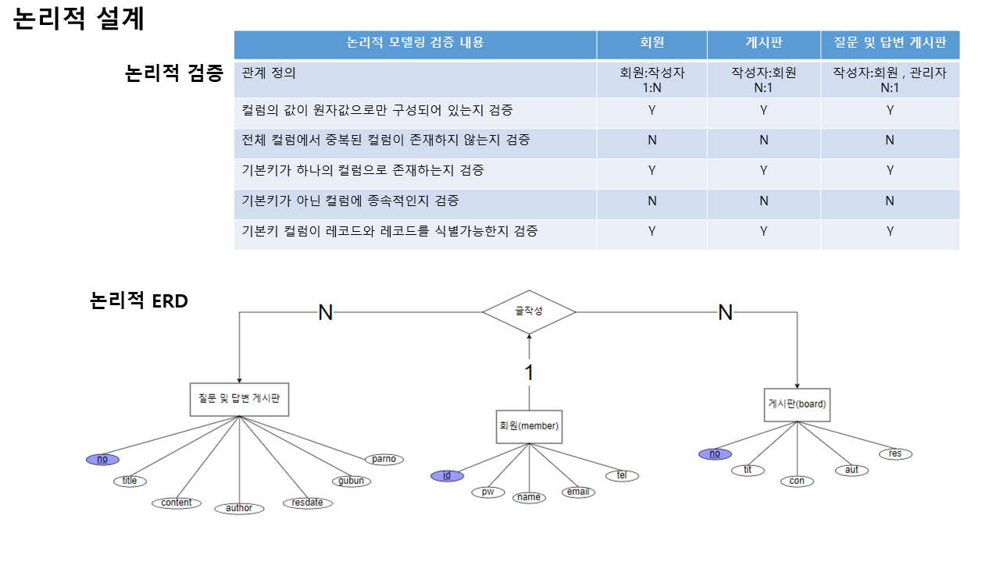
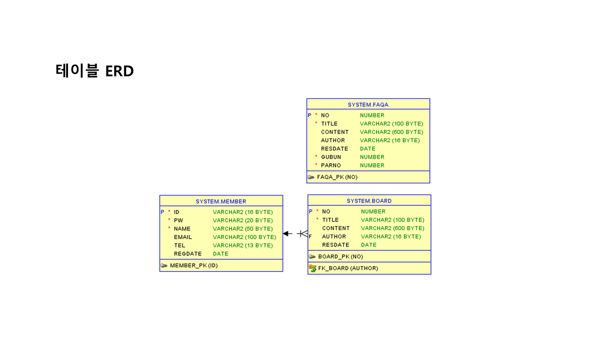

# 프로젝트

## 프로젝트 개요
"WE DISPLAY" 라는 가상 기업을 주제로 jsp의 디렉티브, 스크립트릿, 표현식을 활용하여 선정한 주제(기업명 : 베스킨라빈스)를 
기업형 데스크탑 웹-애플리케이션으로 작성하였으며, Front 부분은 html 및  css, javascript로 작성, 
Back 부분은 jsp를 활용하여  해당 프로젝트의 회원기능인 회원가입, 로그인, 로그아웃, 회원정보 확인,
회원 정보 수정, 회원 탈퇴  및 게시판 관리 , 게시판 목록, 상세글보기, 글작성, 글수정, 글 삭제 등이 구현되어있음.

## 프로젝트 설계

## 페이퍼타입

##